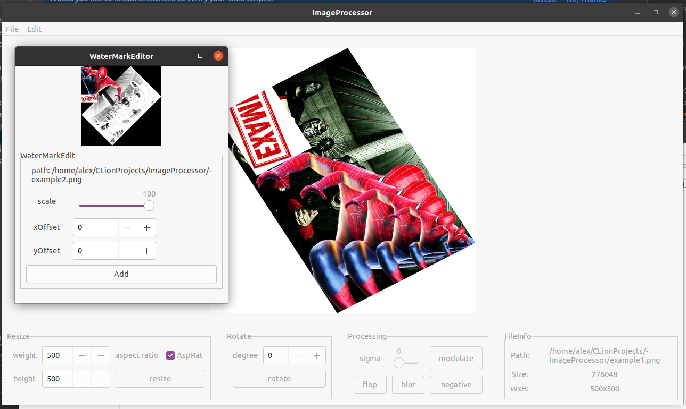

# C++ Gtk3.0 + Magick++ simple image processor

C++ Implementation Image Processor for Linux(Ubuntu20.04lts)

Image Processor has features:
1) Resizing an image with or without aspect ratio; 
2) Rotating an image on current degree;
3) Mirroring an image;
4) Blurring an image on current sigma;
5) Convert to black and white (Modulate);
6) Convert to negative;
7) Watermark overlay;
8) Save/SaveAs an image;

# Install and Build

You need some libs (Gtk, Image Delegators):

sudo apt install -y build-essential libjpeg62-dev libtiff-dev libpng-dev libgtk-3-0 libgtk-3-dev libxml2-dev zlib1g

Install build Magick++:

1) git clone https://github.com/ImageMagick/ImageMagick
2) cd ImageMagick
3) ./configure
4) make -j4
5) sudo make install

if you have problem with undefined magick++ libs
LD_LIBRARY_PATH=/usr/local/lib
export LD_LIBRARY_PATH

Build Project:

1) mkdir build && cd build
2) cmake ..
3) make -j4

or use build.sh

